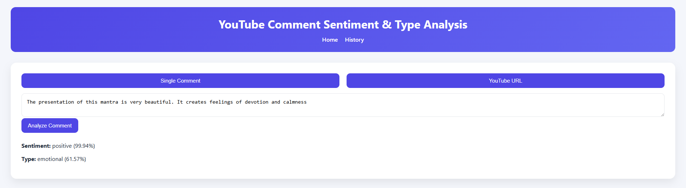
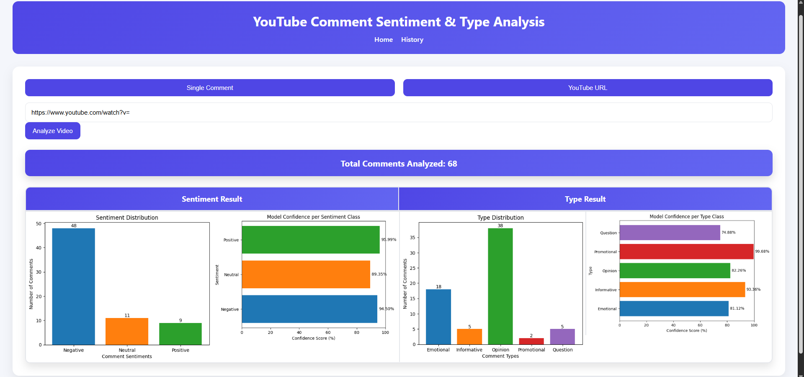

# YouTube Comment Sentiment & Type Analysis – Project Report & Guide 🎥💬

## Overview 📝

This project is an end-to-end NLP/ML pipeline for extracting and analyzing YouTube video comments. The system classifies comment sentiment (positive, negative, neutral) and comment type (emotional, informative, opinion, question, promotional). It supports both API-based and direct user input workflows, and visualizes results for both single comments and entire video comment sections.

## Workflow Summary 🔄

#### 1. **Dataset Creation**: 🗂️

   - **Notebook**: `Notebooks/01_Generate_Youtube_Comment_Dataset.ipynb`
   - Comments are fetched using the YouTube Data API for a predefined list of video IDs via automation 🤖.
   - Comments are labeled using a Hugging Face LLM (Qwen2.5-14B) via prompt-based JSON extraction:
     - **Type**: (opinion 💭, emotional 😢😃, question ❓, informative ℹ️, promotional 📢)
     - **Sentiment**: (positive 😃, negative 😡, neutral 😐)

#### 2. **Preprocessing**: 🧹

   - **Notebook**: `Notebooks/02_Preprocess_Dataset.ipynb`
   - Steps: removal of emojis, HTML tags, URLs, punctuation, special characters, slang replacement, followed by deduplication and null-value removal.
   - Columns are standardized, and separate text versions for both traditional ML/DL and BERT-type models are created.
   - Two final columns: `comment_v1` (slightly cleaned for RNN and NLP Model) and `comment_v2` (fully cleaned for ANN and other Traditional ML model) ✨.
   - Dataset Stats: 
      | Dataset Split | Training | Validation | Test | Kaggle Sentiment |
      | --- | ---: | ---: | ---: | ---: |
      | Percentage | 80% | 10% | 10% | – |
      | Samples | 15393 | 1924 | 1925 | 8842 |
   
      A separate sentiment analysis dataset from [Kaggle](http://kaggle.com/datasets/nit003/bangla-youtube-sentiment-and-emotion-datasets) was used to evaluate models trained on the custom dataset built from scratch. 📊

#### 3. **Model Training & Evaluation**: 🤖

   - Three main approaches:
     - **MLP (Multi-layer Perceptron)**: Uses TF-IDF features.
     - **LSTM/BiLSTM**: Uses tokenized input; vocabulary is built in preprocessing.
     - **BERT/XLM-RoBERTa**: Uses transformer embeddings (`models/bert/...`) and achieves the highest accuracy 🌟.
   - Model results (Accuracy):

     |      Model      |  Sentiment (Test Dataset) |  Type (Test Dataset) | Sentiment (Kaggle Dataset) |
     | --------------- |------------------:|--------------:|------------------------:|
     |      MLP       | 65.04% | 63.06% | 52.64% |
     |      LSTM      | 70.91% | 67.95% | 55.33% |
     |      BiLSTM    | 33.71% | 25.92% | 33.23% |
     | XLM-RoBERTa (base) | **76.68%** | **76.05%** | **65.14%** |

   - All major model results include F1, precision, recall, and confusion matrix available on Notebook files 📈.

#### 4. **Serving & UI**: 🌐
   - FastAPI app (`main.py`) provides both API and web frontend.
   - Three main web pages: Home (`/`) 🏠, History (`/history-page`) 📜, and Plots (`/plots-page`) 📊.
   - Prediction endpoints: `/predict` for single comment 📝, `/analyze` for a YouTube URL 🔗.

#### 5. **Visualization and Reporting (Backend-generated)** 📊

   - The FastAPI backend generates and saves bar plots and confidence graphs for prediction results.
   - Wordclouds ☁️ and class distribution figures are available in the `figures/` folder.

## Project Structure 🗂️

```
Youtube_Comment_Sentiments_&_Type_Analysis/
├── main.py             # ⚡ FastAPI backend, API logic, and database integration.
├── app                 # 🛠️ Core utility scripts (comment cleaning, prediction, plotting).
├── models              # 🧠 Trained model weights, trained model architecture, config files.
├── data                # 💾 All input, intermediate and result datasets.
├── frontend            # 🌐 HTML, JS, and CSS for browser-based interaction and viewing.
├── Notebooks           # 📓 End-to-end Jupyter notebooks for data creation, processing, and model development.
├── DATABASE_SETUP.md   # 🐘 PostgreSQL SETUP documentation and usage guide.
├── README.md           # 📖 Project documentation and usage guide.
├── requirements.txt    # 📦 Python dependencies.
```

## Getting Started 🚀

### Step 1: Clone the Repository 📥

```bash
git clone <https://github.com/sajan-sarker/Youtube_Comment_Sentiments_-_Type_Analysis.git>
cd Youtube_Comment_Sentiments_-_Type_Analysis
```

### Step 2: Setup Environment ⚙️

- Use Python 3.10+
- Create a virtual environment and activate it:

```bash
# Create virtual environment
python -m venv venv

# Activate on Windows
venv\Scripts\activate
```
- Install all dependencies: 
```bash
pip install -r requirements.txt
```

### Step 3: Environment Variables 🌐
- Create a `.env` file in the project root (`.env.example` → `.env`) and update it with your settings.

```
PS_HOST=localhost
PS_DB=your_db_name
PS_USER=your_username
PS_PASSWORD=your_password
YOUTUBE_API_KEY=your_youtube_api_key
```

### Step 4: Database Setup 🗄️
- See **[DATABASE_SETUP.md](./DATABASE_SETUP.md)** for all PostgreSQL setup instructions.

### Step 5: Download Model Weights (Google Drive) 📥
- Download all required model weights from the [Google Drive link](https://drive.google.com/drive/folders/1KZa1i2PokZS4ytwX-KpoGVXmC79l7Rqr?usp=sharing).
- Place the downloaded weights (e.g. `models/bert/model.safetensors`) in the correct subfolders under `/models/` as per repo structure.

### Step 6: Run the Application ▶️
```bash
uvicorn main:app --reload
```

- Visit `http://localhost:8000/`, `/history-page`, and `/plots-page` in your browser.
- If the pages do not load, use the exact host and port printed in the terminal (e.g., `http://127.0.0.1:8000`). 🖥️

---

## Tools, Technologies, and Frameworks Used 🛠️
| Tool 📦                      | Purpose 🎯                                        |
|------------------------------|--------------------------------------------------|
| Python 3.10+ 🐍              | Primary Programming Language                     |
| Jupyter Notebooks 📓         | Prototyping and EDA                              |
| pandas, numpy 🔢             | Data handling                                    |
| scikit-learn, joblib 🤖      | Feature extraction, encoding, saving             |
| pytorch, torchinfo 🔥        | Neural networks, LSTM, BERT                      |
| transformers 🤗              | Pretrained LLMs (HuggingFace, Qwen2.5-14B, XLM-RoBERTa) |
| matplotlib, seaborn, wordcloud 📊 | Visualizations                              |
| nltk, banglanltk 📝          | NLP text preprocessing                           |
| google-api-python-client 🎥  | Comment crawling                                 |
| FastAPI, Pydantic, Uvicorn ⚡ | API backend & serving                           |
| psycopg2-binary, python-dotenv 🗄️ | PostgreSQL and environment management      |
| Qwen2.5-14B (LLM) 🧠         | LLM-based labeling with Few-Shot techniques      |

## Limitations ⚠️
- Model performance may be affected by limited training data and system constraints, which can lead to reduced prediction accuracy, particularly in edge cases. 🐞
- Minor class imbalance (e.g. 'promotional') affects predictions for rare types. ⚖️
- Dataset labeling used prompt-based LLM, so noise or errors are possible (no human-in-the-loop for QA). 🏷️
- Deployment on very low-spec hardware is slow due to large model sizes. 🐌
- Requires external model weights due to GitHub size restrictions. 📦

## Strengths ✅
- Fully automated pipeline: from crawling, preprocessing, and labeling to model training and serving. 🤖
- Bangla, English and Romanize Bangla support for real-world mixed language usage. 🌏
- Seamless API plus browser-based UI for broader accessibility. 🌐
- Visual analytics: plots, wordclouds, and analysis charts for quick interpretation. 📊
- Both DL and LLM/transformer-based models were used. 🧠
- Modular and extensible codebase for future experiments and improvements. 🛠️

## Sample Result Screenshots 🖼️


---



For more details, see Jupyter Notebooks for code. 📓
